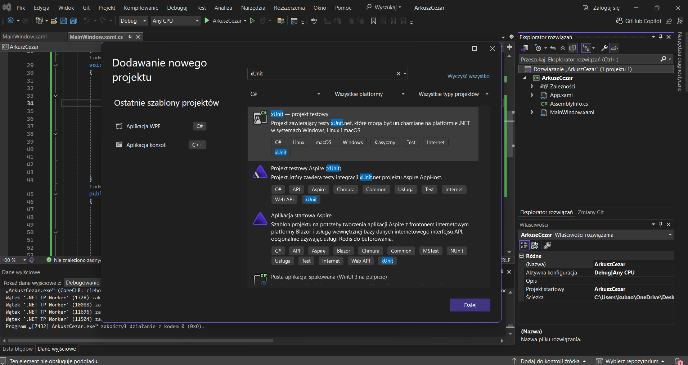
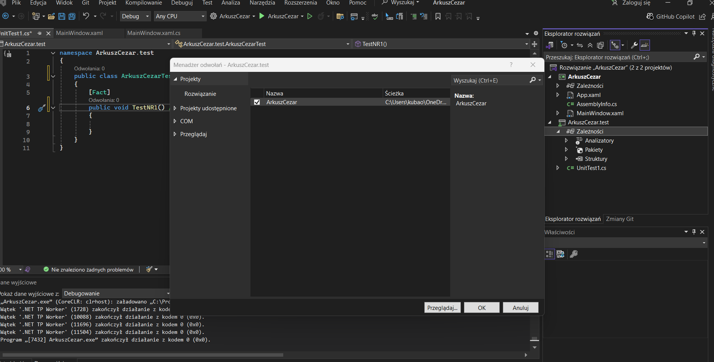
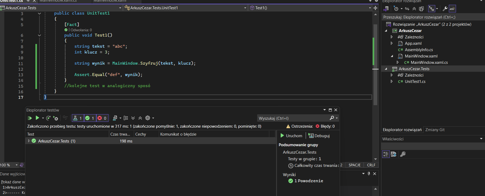
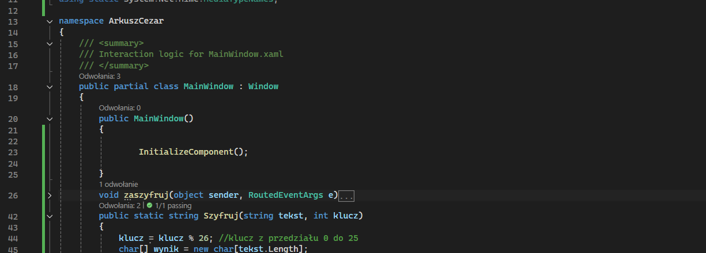

# Instrukcja dodania testów jednostkowych xUnit do projektu WPF 

## 1. Informacje wstępne

Projekt **ArkuszCezar** (na którym jest przykład) jest aplikacją desktopową WPF napisaną w technologii **.NET 8 (net8.0-windows7.0)**.  
Celem  jest pokazanie, jak dodać i uruchomić **testy jednostkowe xUnit** dla logiki szyfru Cezara.

---

## 2. Dodanie projektu testowego xUnit // screen 1

1. Otwórz rozwiązanie **ArkuszCezar** w Visual Studio
2. Kliknij **PPM na Solution**
3. Wybierz **Add → New Project**
4. Wybierz **xUnit Test Project (.NET)**
5. Nazwij projekt: <NazwaArkusza>.Tests   // wtym przypadku bedzie to ArkuszCezar.Tests

## 3. Dodanie referencji do projektu WPF // screen 2

1.Kliknij **PPM na ArkuszCezar.Tests**

2.następnie **Add → Project Reference**

będziemy testowac funckje **public static string Szyfruj(string tekst, int klucz)**  // screen 4

// screen 3
```csharp
namespace ArkuszCezar.Tests
{
    public class UnitTest1
    {
        [Fact]
        public void Test1()
        {
            string tekst = "abc";
            int klucz = 3;

            string wynik = MainWindow.Szyfruj(tekst, klucz); // mainwindow ponwieważ funkcja szyfruj jest w klasie main window

            Assert.Equal("def", wynik);
        }
        //kolejne test w analogiczny sposob
    }
}

```


### Screen 1 

### Screen 2 

### Screen 3 

### Screen 4 
