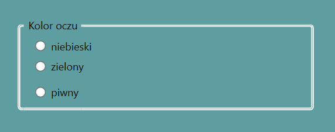

# Kontrolki

Powrót na start -> [Start](./root.md)

## TextBox
Służy do wprowadzania i edycji niesformatowanego tekstu przez użytkownika. Podstawowa kontrolka formularzy.

### Przykład kodu
```xml
<TextBox
  x:Name="tbMultiLine"
  TextWrapping="Wrap"
  AcceptsReturn="True"
  VerticalScrollBarVisibility="Visible"
>
    Przykładowy tekst, który użytkownik może edytować
</TextBox>
```

### Właściwości
- `Name` - chyba wiadomo
- `TextWrapping="Wrap"` - zawija linie tekstu, jak się nie mieści zawija do nowego wiersza i automatycznie rozszerza TextBoxa, żeby uwzględnić miejsce dla nowego wiersza
- `AcceptsReturn="True"` - powoduje, że po wciśnięciu RETURN (enter) zostanie wstawiony nowy wiersz, automatycznie rozszerza
- `VerticalScrollBarVisibility="Visible"` - dodaje pasek przewijania do TextBox, jeśli TextBox rozszerza się poza rozmiar ramy lub okna, który go otacza

---

## TextBlock
Służy do wyświetlania tekstu na ekranie. Jest lżejszy od TextBoxa (zużywa mniej zasobów), ale użytkownik nie może edytować jego zawartości.

### Przykład kodu
```xml
<TextBlock
  Text="Przykładowy tekst"
  TextWrapping="Wrap"
  TextTrimming="CharacterEllipsis"
  Foreground="Blue"
  FontSize="14"
/>
```

### Właściwości
- `Text` - Treść wyświetlana w kontrolce.
- `TextWrapping="Wrap"` - Zawija tekst do nowej linii, jeśli nie mieści się w szerokości kontrolki.
- `TextTrimming="CharacterEllipsis"` - Jeśli tekst się nie mieści, ucina go i dodaje trzy kropki (...) na końcu.
- `Foreground="Blue"` - Kolor czcionki.
- `FontSize="14"` - Rozmiar czcionki w pikselach (device independent pixels).

---

## Button
Przycisk po prostu c:

### Przykład kodu
```xml
<Button
  Content="Zatwierdź"
  Click="Button_Click"
  IsDefault="True"
  IsEnabled="False"
/>
```

### Właściwości
- `Content` - Zawartość przycisku (może to być tekst, ale też np. obrazek lub inna kontrolka).
- `Click="Button_Click"` - Nazwa metody w kodzie C# (event handler), która wykona się po kliknięciu.
- `IsDefault="True"` - Sprawia, że wciśnięcie klawisza ENTER na klawiaturze automatycznie klika ten przycisk (np. w formularzach logowania).
- `IsEnabled="False"` - Wyłącza przycisk (jest wyszarzony i nie można go kliknąć).

### Obsługa zdarzenia w C#
Potem w .xaml.cs (metoda)
```cs
private void Button_Click(object sender, RoutedEventArgs e)
{
    //co ma robic ta funkcja
}
```

---

## CheckBox
Pozwala użytkownikowi wybrać opcję typu "Tak/Nie" (True/False). Można zaznaczyć wiele CheckBoxów niezależnie od siebie.

### Przykład kodu
```xml
<CheckBox
  Content="Zgadzam się na warunki"
  IsChecked="True"
/>
```

### Właściwości
- `Content` - Tekst wyświetlany obok kwadracika.
- `IsChecked="True"` - Określa stan zaznaczenia (True = zaznaczony, False = odznaczony).

---

## RadioButton
Służy do wyboru **tylko jednej** opcji z grupy. Zaznaczenie jednego elementu automatycznie odznacza pozostałe w tej samej grupie.

### Przykład frontu
```xml
<StackPanel>
  <RadioButton x:Name="rbPlecKobieta" GroupName="Plec" Content="Kobieta" />
  <RadioButton x:Name="rbPlecMezczyzna" GroupName="Plec" Content="Mężczyzna" IsChecked="True" />
</StackPanel>
```

### Przykład logiki
Niestety nie możemy pobrać po prostu wartości z np. GroupName'a, tylko niestety musimy sprawdzać każdy jeden guzik, czy jest zaznaczony.

```cs
if (rbPlecKobieta.IsChecked == true)
{
     // zaznaczono kobietę
}
else if (rbPlecMezczyzna.IsChecked == true)
{
    // zaznaczono chopa
}
```

### Właściwości
- `GroupName="Plec"` - Kluczowa właściwość. Wszystkie RadioButtony o tej samej nazwie grupy działają razem (tylko jeden może być wybrany).
- `IsChecked="True"` - Domyślnie zaznacza tę opcję przy uruchomieniu programu.
- `Content` - Tekst opcji.

---

## ComboBox
Rozwijana lista wyboru. Pozwala użytkownikowi wybrać jedną wartość z listy, oszczędzając miejsce na ekranie (widać tylko wybrany element, reszta po rozwinięciu).

### Przykład kodu
```xml
<ComboBox
  IsEditable="True"
  SelectedIndex="0"
  Text="Wybierz opcję"
>
  <ComboBoxItem Content="Opcja 1" />
  <ComboBoxItem Content="Opcja 2" />
</ComboBox>
```

### Właściwości
- `IsEditable="True"` - Pozwala użytkownikowi wpisać własną wartość, której nie ma na liście (działa trochę jak TextBox połączony z listą).
- `SelectedIndex="0"` - Ustawia domyślnie wybrany element (0 to pierwszy element listy).
- `ComboBoxItem` - Pojedynczy element wewnątrz listy rozwijanej.

---

## ListBox
Wyświetla listę elementów w pionie. W przeciwieństwie do ComboBoxa, lista jest cały czas widoczna.

### Przykład kodu
```xml
<ListBox
  SelectionMode="Multiple"
  Height="100"
>
  <ListBoxItem Content="Element A" />
  <ListBoxItem Content="Element B" />
</ListBox>
```

### Właściwości
- `SelectionMode="Multiple"` - Pozwala użytkownikowi zaznaczyć więcej niż jeden element (np. trzymając Ctrl). Domyślnie jest "Single" (do zaznaczenia tylko jeden element).
- `Height="100"` - Ustala sztywną wysokość listy (jeśli elementów jest więcej, pojawi się pasek przewijania).

---

## ListView
Bardziej zaawansowana lista, zoptymalizowana do wyświetlania danych w kolumnach (widok szczegółowy / GridView).

### Przykład kodu
```xml
<ListView ItemsSource="{Binding Users}">
  <ListView.View>
    <GridView>
      <GridViewColumn Header="Imię" DisplayMemberBinding="{Binding Name}" />
      <GridViewColumn Header="Wiek" DisplayMemberBinding="{Binding Age}" Width="50"/>
    </GridView>
  </ListView.View>
</ListView>
```

### Właściwości
- `ItemsSource="{Binding Users}"` - Źródło danych (lista obiektów w kodzie C#, którą wyświetlamy).
- `GridView` - Tryb widoku, który pozwala na definiowanie kolumn.
- `GridViewColumn Header="..."` - Definiuje nagłówek kolumny.
- `DisplayMemberBinding` - Wskazuje, którą właściwość obiektu (np. Name) wyświetlić w tej kolumnie.

---

## DataGrid
Potężna tabela do wyświetlania i edycji dużych zbiorów danych. Przypomina Excela.

### Przykład kodu
```xml
<DataGrid
  ItemsSource="{Binding UsersList}"
  AutoGenerateColumns="False"
  CanUserAddRows="False"
  AlternatingRowBackground="LightGray"
>
  <DataGrid.Columns>
    <DataGridTextColumn Header="Imię" Binding="{Binding Name}" Width="*" />
    <DataGridTextColumn Header="Wiek" Binding="{Binding Age}" Width="50" />
    <DataGridCheckBoxColumn Header="Admin" Binding="{Binding IsAdmin}" />
  </DataGrid.Columns>
</DataGrid>
```

### Właściwości
- `ItemsSource="{Binding UsersList}"` - Źródło danych (lista obiektów C#).
- `AutoGenerateColumns="False"` - Kluczowe! "False" oznacza, że sami decydujemy jakie kolumny wyświetlić (jak w kodzie wyżej). "True" wrzuciłoby wszystko jak leci.
- `CanUserAddRows="False"` - Usuwa pusty wiersz na dole tabeli (użytkownik nie może dodawać nowych rekordów wpisując w puste pole).
- `AlternatingRowBackground="LightGray"` - Co drugi wiersz ma szare tło (tzw. zebra), poprawia czytelność.
- `DataGridTextColumn / CheckBoxColumn` - Typy kolumn. "Header" to nagłówek, "Binding" to dane z obiektu.
- `Width="*"` - Kolumna rozciąga się, zajmując całe pozostałe wolne miejsce.

---

## DockPanel
Kontener układu, który "przykleja" (dokuje) elementy potomne do krawędzi: Góry, Dołu, Lewej lub Prawej.

### Przykład kodu
```xml
<DockPanel LastChildFill="True">
  <Button DockPanel.Dock="Top" Content="Menu" />
  <Button DockPanel.Dock="Bottom" Content="Stopka" />
  <TextBox Text="Środek" />
</DockPanel>
```

### Właściwości
- `LastChildFill="True"` - Ostatni element w kodzie (tutaj TextBox) automatycznie rozciągnie się na całą pozostałą wolną przestrzeń pośrodku, ewentualnie można ustawić false.
- `DockPanel.Dock="Top"` - Właściwość doczepiana (Attached Property), mówi rodzicowi, do której krawędzi przykleić ten konkretny element.

---

## WrapPanel
Kontener, który układa elementy jeden obok drugiego (domyślnie poziomo). Gdy brakuje miejsca w linii, przenosi element do nowego wiersza.

### Przykład kodu
```xml
<WrapPanel Orientation="Horizontal" ItemWidth="100">
  <Button Content="1" />
  <Button Content="2" />
  <Button Content="3" />
</WrapPanel>
```

### Właściwości
- `Orientation="Horizontal"` - Elementy układają się od lewej do prawej (domyślne). "Vertical" układałoby w kolumnach z góry na dół.
- `ItemWidth="100"` - Wymusza stałą szerokość dla wszystkich elementów wewnątrz panelu (opcjonalne).

---

## TabControl

No to ogólnie jest to taka kontrolka, która pozwala robić zakładki i se możesz przełączać tak jak w przeglądarce np.

### Przykład kodu

```xml
<!-- Tworzymy TabControl z dwiema zakładkami -->
<TabControl>
    <!-- To jest tak jakby nazwa tej pierwszej zakładki -->
    <TabItem Header="Pierwsza zakładka"> 
        <!-- A tutaj środeczek -->
        <TextBlock Text="Zawartość pierwszej zakładki"/> 
    </TabItem>

    <TabItem Header="Druga zakładka">
        <TextBlock Text="Zawartość drugiej zakładki"/>
    </TabItem>
</TabControl>
```

---

## ProgressBar

Po prostu pasek postępu, np. ile masz procent na ile.

### Przykład kodu

```xml
<!-- Tworzymy po prostu ziomka, minimum to jest jaka może być minimalna wartość analogicznie 
maksimum, a value to jaką ustawiamy, wysokość oczywiście odnosi się do wysokości paska. -->
<ProgressBar Minimum="0" Maximum="100" Value="50" Height="20"/> 
```

---

## Expander

Tu jest taki byk, że klikasz strzałke i się rozwija

### Przykład kodu

```xml
<!-- No to jest tytuł tego rozwijacza obok strzałeczki -->
<Expander Header="Pokaż szczegóły">
    <TextBlock Text="Tu są jakieś dodatkowe informacje"/> <!-- A tu środeczek -->
</Expander>
```

---

## Frame/Page

To służy do nawigacji między stronami w aplikacji też podobnie jak w przeglądarce

### Przykład kodu

```xml
<Frame x:Name="MainFrame" /> <!-- Frame w oknie -->
```

```csharp
MainFrame.Navigate(new Page1()); // Przełączanie widoku w C#
```

---

## Grid

No to jest taka kontrolka do robienia układu w wierszach i kolumnach

### Przykład kodu

```xml
<Grid>
    <Grid.RowDefinitions> <!-- No wiersz -->
        <RowDefinition Height="Auto"/>
        <RowDefinition Height="*"/>
    </Grid.RowDefinitions>

    <Grid.ColumnDefinitions> <!-- Kolumna -->
        <ColumnDefinition Width="200"/>
        <ColumnDefinition Width="*"/>
    </Grid.ColumnDefinitions>

    <TextBlock Text="Lewy panel" Grid.Row="0" Grid.Column="0"/> <!-- I tutaj sobie ustawiamy w którym tym bloczku na tej siatce to ma być -->
    <TextBlock Text="Prawy panel" Grid.Row="1" Grid.Column="1"/> <!-- I tu też -->
</Grid>
```

---

## StackPanel

To ustawia elementy pionowo albo poziomo

### Przykład kodu

```xml
<StackPanel Orientation="Vertical"> <!-- Tutaj orientacje ustalamy czy poziomo czy pionowo -->
    <Button Content="Klik 1"/> <!-- A tu już zawartość -->
    <Button Content="Klik 2"/>
</StackPanel>
```

## GroupBox 
> GroupBox to WPFowy ekwiwalent znacznika ```<Fieldset> ``` Jest to obramówka grupująca powiązane ze sobą pola formularza

Przykładowy 


Kilka uwag:

+ Nagłówek GroupBoxa to ``` <GroupBox Header = "..."> ```
+ Wewnątrz GroupBoxa może znajdować się tylko jeden element - Dowolny, ale sugerowany jest np. `<StackPanel>`

Przykładowy kod 

```xml 
<GroupBox Header="Login Credentials" Margin="10">
    <StackPanel Margin="5">
        <Label Content="Username:"/>
        <TextBox/>
        <Label Content="Password:"/>
        <PasswordBox/>
    </StackPanel>
</GroupBox>

``` 

---

# ToolBar – paski narzędziowe

ToolBar to kontener na przyciski lub inne elementy, zwykle w górnej części okna. Służy do szybkiego dostępu do akcji, np „Open”, „Save”.

## Kod

ToolBarTray - pojemnik na ToolBary (np obok siebie, jeden pod drugim).
DockPanel.Dock="Top" ustawia cały pasek na górze okna.
ToolBar - pojedynczy pasek przycisków lub kontrolek (np Button, ComboBox, TextBox).
Atrybut Click="Open_Click" mówi: „Open clicked”.

```xml
<ToolBarTray DockPanel.Dock="Top">
  <ToolBar>
    <Button Click="Open_Click">Open</Button>
    <Button Click="Save_Click">Save</Button>
  </ToolBar>
</ToolBarTray>
```

```cs
private void Open_Click(object sender, RoutedEventArgs e) => MessageBox.Show("Open clicked");
private void Save_Click(object sender, RoutedEventArgs e) => MessageBox.Show("Save clicked");
```

Użytkownik klika przycisk na pasku ToolBar.
Wydarzenie Click (Open_Click) wywołuje przypisaną metodę w C# i pokazuje "Open clicked"
Można dodawać dowolne kontrolki do ToolBar i przypisywać im własne akcje.

---

# Menu / ContextMenu – menu górne i podręczne

W WPF mamy dwa główne rodzaje menu:
- Menu (górne) – pasek poleceń u góry okna, zawsze widoczny.
- ContextMenu (podręczne) – menu wywoływane prawym przyciskiem myszy, pojawia się przy konkretnym elemencie.

## Menu (górne)

Używa się kontrolki Menu i MenuItem.
Menu to kontener dla wszystkich pozycji menu.
MenuItem to pojedyncza pozycja lub podmenu.
Atrybut Header ustawia tekst widoczny w menu.
_ w Header (_File) tworzy skrót klawiszowy Alt+F.
Atrybut Click="Open_Click" mówi: „Open clicked”.

```xml
<Menu DockPanel.Dock="Top">
  <MenuItem Header="_File">
    <MenuItem Header="Open" Click="Open_Click"/>
    <MenuItem Header="Exit" Click="Exit_Click"/>
  </MenuItem>
</Menu>
```

```cs
private void Open_Click(object sender, RoutedEventArgs e) => MessageBox.Show("Open clicked");
private void Exit_Click(object sender, RoutedEventArgs e) => MessageBox.Show("Exit clicked");
```

Użytkownik klika w „File”.
Pojawia się podmenu z „Open” i „Exit”.
Kliknięcie wywołuje metodę w C#.

## ContextMenu (podręczne)

Wywoływane tylko po kliknięciu prawym przyciskiem myszy.
Pojawia się dokładnie przy elemencie, do którego jest przypisane.
Tworzy się poprzez Element.ContextMenu i ContextMenu wewnątrz niego.
MenuItem działa tak samo jak w górnym menu – Click wywołuje metodę w C#.

```xml
<Button Content="Right Click Me">
  <Button.ContextMenu>
    <ContextMenu>
      <MenuItem Header="Option 1" Click="Option1_Click"/>
      <MenuItem Header="Option 2" Click="Option2_Click"/>
    </ContextMenu>
  </Button.ContextMenu>
</Button>
```

```cs
private void Option1_Click(object sender, RoutedEventArgs e) => MessageBox.Show("Option 1 clicked");
private void Option2_Click(object sender, RoutedEventArgs e) => MessageBox.Show("Option 2 clicked");
```

Użytkownik kliknął prawym przyciskiem na przycisk.
Pojawia się menu z opcjami „Option 1” i „Option 2”.
Kliknięcie wywołuje metodę w C#.

---

# TreeView – struktury drzewiaste

TreeView to kontrolka służąca do wyświetlania danych w hierarchii, czyli „drzewa”.
Każdy węzeł (TreeViewItem) może mieć dzieci, dzięki czemu można tworzyć zagnieżdżone struktury.

## Kod

### Statyczne TreeView

Tworzymy je bezpośrednio w XAML.
Węzły (TreeViewItem) są zdefiniowane od razu, np. root + dzieci.

```xml
<TreeView x:Name="myTree">
  <TreeViewItem Header="Root">
    <TreeViewItem Header="Child 1"/>
    <TreeViewItem Header="Child 2"/>
  </TreeViewItem>
</TreeView>
```

„Root” to węzeł główny.
„Child 1” i „Child 2” są dziećmi.
Użytkownik może rozwijać i zwijać węzły klikając strzałkę obok.

### Dynamiczne dodawanie w C#

Możemy dodawać węzły w C# w czasie działania programu.
Typowy scenariusz: przycisk „Add Node” dodaje nowy element.

```xml
<Button Content="Add Node" Click="AddDynamic_Click"/>
```

```cs
private void AddDynamic_Click(object sender, RoutedEventArgs e)
{
    myTree.Items.Add(new TreeViewItem { Header = "New Node" });
}
```

Użytkownik klika przycisk.
Metoda w C# tworzy nowy TreeViewItem.
Element jest dodawany do głównej kolekcji węzłów (myTree.Items).

### TreeView z ContextMenu

Możemy przypisać menu podręczne do całego TreeView.
Menu pojawia się po kliknięciu prawym przyciskiem myszy.
Można np. dodać lub usunąć węzeł.

```xml
// opcje pojawiają się po kliknięciu PPM
<TreeView x:Name="treeWithMenu">
  <TreeView.ContextMenu>
    <ContextMenu>
      <MenuItem Header="Add Node" Click="AddNode_Click"/>
      <MenuItem Header="Remove Node" Click="RemoveNode_Click"/>
    </ContextMenu>
  </TreeView.ContextMenu>
</TreeView>
```

```cs
private void AddNode_Click(object sender, RoutedEventArgs e)
{
    treeWithMenu.Items.Add(new TreeViewItem { Header = "Dynamic Node" });
}

private void RemoveNode_Click(object sender, RoutedEventArgs e)
{
    if (treeWithMenu.Items.Count > 0)
        treeWithMenu.Items.RemoveAt(treeWithMenu.Items.Count - 1);
}
```

Użytkownik kliknął PPM na TreeView.
Pojawia się menu z opcjami „Add Node” i „Remove Node”.
Kliknięcie wywołuje metodę w C#: dodaje lub usuwa węzeł.