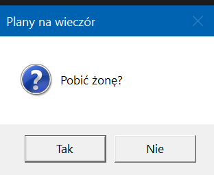

# MessageBox i GroupBox w WPF


## MessageBox 

> MessageBox jest niczym innym niż wyskakującym okienkiem z jakąś informacją, jego obsługa jest bardzo prosta

Kilka faktów nt. MessageBoxa w WPFie

+ Przeznaczony do komunikatów dla użytkownika 
+ Formalnie jest nazywany *dialogiem modalnym*, czyli takim, który wymaga zamknięcia i zatrzymuje aplikacje na czas jego wyświetlania
+ Najwazniejszą metodą jest `MessageBox.Show()`, poza tym, jego modyfikowalność jest ograniczona 

Obsługa metody MessageBox.Show() 
````cs
MessageBox.Show(
        string komunikat, 
        string tytuł,
        [Jeden z predefiniowanych przycisków],
        [Ikonka wewnątrz],
);
````

Przykładowo: 

````cs
MessageBoxResult result = MessageBox.Show(
    "Pobić żonę?",      // Komunikat
    "Plany na wieczór",   // Tytuł
    MessageBoxButton.YesNo,     // Przyciski
    MessageBoxImage.Question    // Ikonka
);
````
Rezultat:  



### Przyciski i ich obsługa
Oto przykładowe przyciski MessageBoxa w WPF 
+ `MessageBoxButton.OK` 
+ `MessageBoxButton.OKCancel` 
+ `MessageBoxButton.YesNo`  
+ `MessageBoxButton.YesNoCancel`
+ `MessageBoxButton.RetryCancel` 

Oraz obsługa przykładowego przycisku, wróćmy do poprzedniego przykładu:

````cs 
MessageBoxResult result = MessageBox.Show(
    "Pobić żonę?",      // Komunikat
    "Plany na wieczór",   // Tytuł
    MessageBoxButton.YesNo,     // Przyciski
    MessageBoxImage.Question    // Ikonka
);

if (result == MessageBoxResult.Yes) {
    // Jakiś szpont
}

````


### Ikonki MessageBoxa 

+ Informacja - `MessageBoxImage.Information`
+ Pytanie - `MessageBoxImage.Question`
+ Ostrzeżenie - `MessageBoxImage.Warning`
+ Błąd - `MessageBoxImage.Error`
