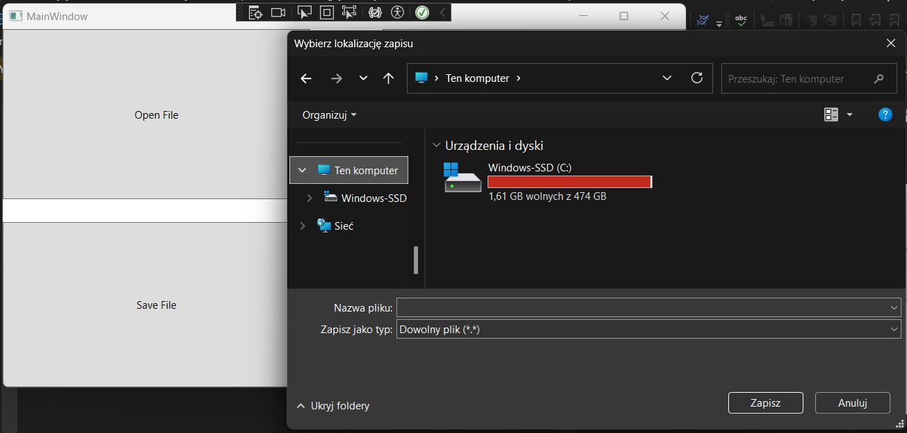
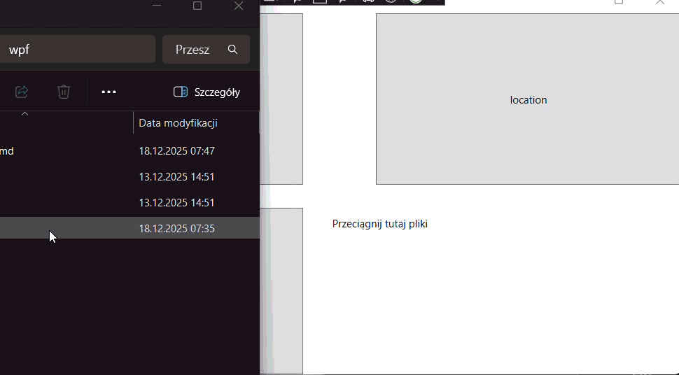

# Obsługa plików (dialog)

Powrót na start -> [Start](./root.md)



## OpenFileDialog
Otwarcie dialogu, nazwa okienka, z którego wybiera się plik, filtrowanie rozszerzeń:
```cs
OpenFileDialog dialog = new OpenFileDialog;
dialog.Title = "Wybierz plik tekstowy"; //nazwa (u góry po lewej, zwykle Eksplorator plików)
dialog.Filter = "Pliki tekstowe (*.txt)|*.txt|Wszystkie pliki (*.*)|*.*"; //o filtrach niżej
```
Po zatwierdzeniu pliku: (przykład - wczytanie zawartości pliku do zmiennej)
```cs
if (dialog.showDialog() == true) {
    string sciezka = dialog.FileName; //nazwa wybranego w dialogu pliku
    string zawartosc = File.ReadAllText(path);
}
```
## SaveFileDialog
Zapisywanie pliku, podanie własnej zawartości, wybiór lokalizacji:
```cs
SaveFileDialog dialogZapisu = new SaveFileDialog();
dialogZapisu.Title = "Zapisz plik";
dialogZapisu.Filter = "Pliki tekstowe (*.txt)|*.txt";
if (dialog.ShowDialog() == true) //otwarcie okienka wyboru pliku i OK
{
    string path = dialogZapisu.FileName;
    File.WriteAllText(path, "Przykładowa treść zapisana do pliku.");
}
```
### Przykład przycisku i metody
```xml
<Button Click="OpenFileButton_Click" Name="OpenFileButton">Open File</Button>
```
```cs
private void OpenFileButton_Click(object sender, RoutedEventArgs e)
{
    OpenFileDialog dialog = new OpenFileDialog();
    dialog.Title = "Wybierz plik tekstowy";
    dialog.Filter = "Pliki tekstowe (*.txt)|*.txt|Wszystkie pliki (*.*)|*.*";

    // Jeśli użytkownik kliknie "OK"
    if (dialog.ShowDialog() == true)
    {
        string path = dialog.FileName;
        string content = File.ReadAllText(path);
        MessageBox.Show($"Zawartość pliku:\n{content}");
    }
}
```

### Filtry: 
Między `|` umieszczamy nazwę rozszerzenia i rozszerzenie

```cs
dialog.Filter = "Pliki tekstowe (*.txt)|*.txt|Wszystkie pliki (*.*)|*.*";
```
 w przykładzie:
- #### "Pliki tekstowe (*.txt)"
→ opis widoczny w oknie dialogowym jako nazwa filtra

- #### "*.txt"
→ wzorzec plików, które będą widoczne po wybraniu tego filtra
(czyli tylko pliki zakończone na .txt)

- #### "Wszystkie pliki (.)"
→ drugi opis opcji filtra

- #### "."
→ wzorzec dopuszczający wszystkie pliki niezależnie od rozszerzenia

## Drag & Drop



### Pole Drag & Drop w XML:
```xml
<Border AllowDrop="True" Drop="Border_Drop" DragOver="Border_DragOver">
    <TextBlock Text="Przeciągnij tutaj pliki" />
</Border>
```

### Metody w C#:
#### Po najechaniu plikiem na obszar:
```cs
private void Border_DragOver(object sender, DragEventArgs e)
{
    // Sprawdzamy, czy przeciągany obiekt to pliki
    if (e.Data.GetDataPresent(DataFormats.FileDrop))
        e.Effects = DragDropEffects.Copy; //żeby człowiek wiedział, że mieli
    else
        e.Effects = DragDropEffects.None;

    e.Handled = true;
}
```

#### Po upuszczeniu pliku:
```cs
private void Border_Drop(object sender, DragEventArgs e)
{
    if (e.Data.GetDataPresent(DataFormats.FileDrop))
    {
        string[] files = (string[])e.Data.GetData(DataFormats.FileDrop); //tablica z lokalizacjami plików

        //np. wypisanie plików(lokalizacje):
        string msg = "Przeciągnięte pliki:\n" + string.Join("\n", files);
        MessageBox.Show(msg);
    }
}
```
